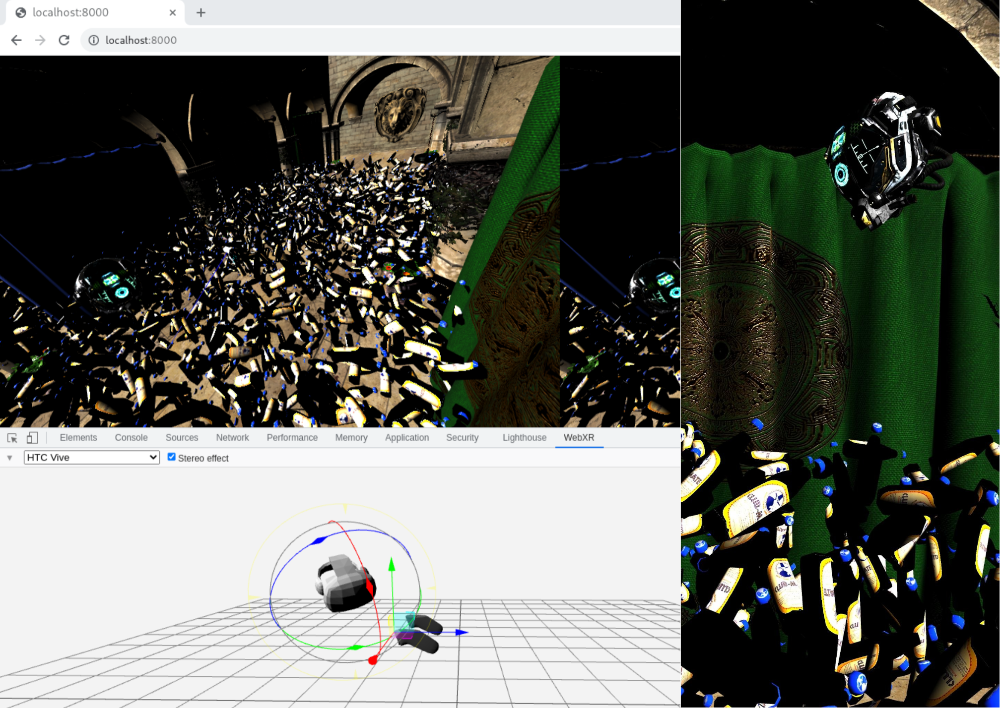

# Mateversum 🍾

Mateversum (pronounced: MAH-tay-ver-sum) is a peer-to-peer WebXR metaverse project.

The idea is that you'd be able to connect to a network of peers, load into a room, choose an avatar and hang out, all without any central servers. Inside a web browser.

Some of this sort-of works at the moment, but it's got a long way to go.

_Real time networking between a browser on a laptop running the [WebXR API Emulator] extension and a browser on an android phone running in AR mode. I threw this very quickly so the lighting and bottle model could be better._

## Running It

Mateversum is really not fit for any kind of public use right now. That said, you can try out an online version at: https://github.com/expenses/webxr-pbr-wasm (I'm going to change the address for that at some point). Simply wait for it to load the initial WASM blob and click 'Start VR' on a desktop (with the [WebXR API Emulator] extension) or 'Start AR'. The default models/textures are pretty huge (250 mb or so) so I recommend doing this on a decent wifi connection. They'll be cached after the initial load though.

## Compiling It

On a Unix/WSL machine run `sh run.sh` to compile Mateversum and start a local server. You'll need Rust, [`wasm-bindgen`](https://github.com/rustwasm/wasm-bindgen) and the [Caddy](https://caddyserver.com/) HTTP server (or equivalent) for this.

### Compiling the shaders

Because we're especially cool, we use [rust-gpu](https://github.com/EmbarkStudios/rust-gpu) for the GPU shaders. Run `sh compile_shaders.sh` to compile these, but the script needs some special stuff to be installed for that I can't be bothered documenting it yet.

### Compiling the javascript for networking

The javascript code that we use for networking can be built by `cd`ing into `networking-js`, running `npm install` followed by `npm run build`.

## A Few Implementation Details

We support models in the brilliant [glTF](https://github.com/KhronosGroup/glTF) format. The core of glTF is a JSON file that references both binary geometry data blobs and texture files as external URLs. These URLs can be delivered either by standard HTTP/HTTPS or ([IPFS](https://ipfs.io/) (currently only through a gateway but we'll hopefully use [js.ipfs.io](https://js.ipfs.io/) soon.)). We support textures files in the [KTX 2](https://github.khronos.org/KTX-Specification/) format. This lets us load textures progressively up from 1x1 pixel [mipmaps](https://en.wikipedia.org/wiki/Mipmap) all the way to 4096x4096 and beyond (with adjustable limits so that you can control bandwidth and memory).

Peer-to-peer networking is done via WebRTC. It's extremely bare-bones at the moment, with everyone just connecting to a single room and sending the position of their hand and hands to everyone else. WebRTC requires you to do a handshake where one peer sends a session descriptor offer packet to another peer, who then sends an answer packet back.

The transmission of these packets has to happen over an existing channel, usually using what's known as a signalling server. We're currently using Webtorrent trackers as signalling servers using the [trystero](https://github.com/dmotz/trystero) library, but using a [custom fork](https://github.com/expenses/trystero/tree/key-signing) that cryptographically signs the packets to prevent a bad server from performing a Man-in-the-middle attack (MITM).

Ideally we'd use libp2p for most if not all networking, but their WebRTC support isn't especially stable yet. See https://github.com/libp2p/specs/issues/220.

[WebXR API Emulator]: https://chrome.google.com/webstore/detail/webxr-api-emulator/mjddjgeghkdijejnciaefnkjmkafnnje